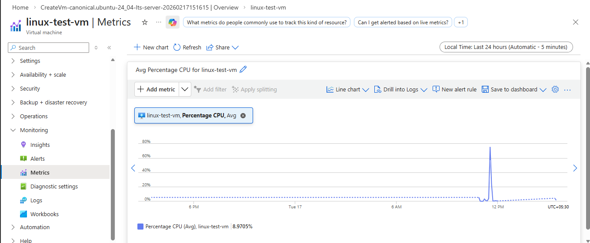
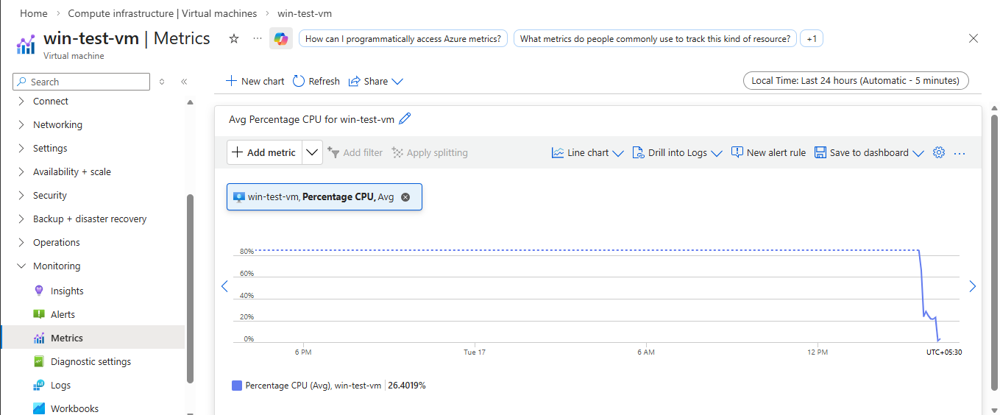
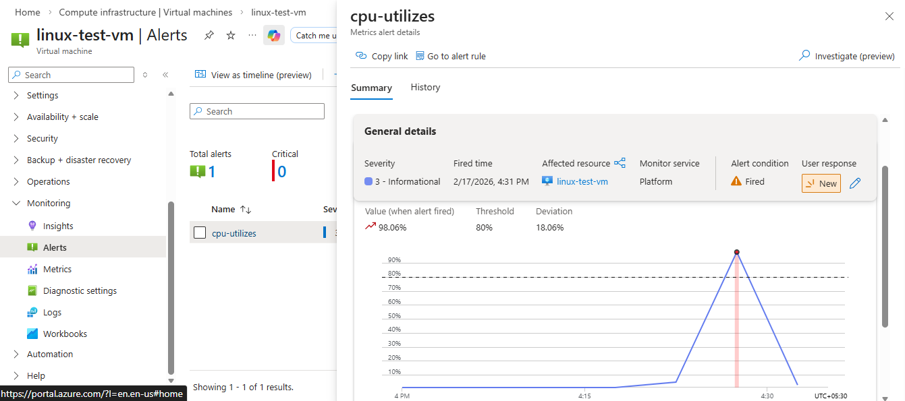
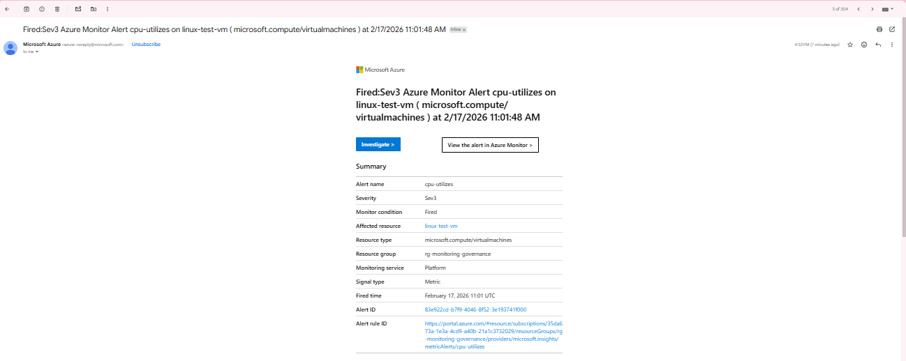

## 🛠 Step-by-Step Implementation

---

## 🔹 STEP 1 — Create Resource Group

Create a resource group:

| Setting | Value |
|---|---|
| Name | `rg-monitoring-governance` |
| Region | `Central India` |

---

## 🔹 STEP 2 — Create Log Analytics Workspace

1. Search **Log Analytics Workspace** in Azure Portal.
2. Click **Create**.

| Setting | Value |
|---|---|
| Name | `law-enterprise-monitor` |
| Region | `Central India` |
| Pricing Tier | Pay-As-You-Go (Free tier usage) |

---

## 🔹 STEP 3 — Deploy Ubuntu VM

Create a Linux virtual machine.

| Setting | Value |
|---|---|
| Name | `vm-ubuntu-monitor` |
| Image | Ubuntu 22.04 LTS |
| Size | B1s (Free-friendly) |
| Authentication | SSH |
| Public IP | Yes |

---

## 🔹 STEP 4 — Deploy Windows VM

Create a Windows virtual machine.

| Setting | Value |
|---|---|
| Name | `vm-windows-monitor` |
| Image | Windows Server 2019 / 2022 |
| Size | B1s |
| Authentication | Username + Password |
| Public IP | Yes |

---

## 🔹 STEP 5 — Enable Monitoring on Ubuntu VM

Navigate to:
VM → vm-ubuntu-monitor → Insights → Enable

Select: Azure installs monitoring agent automatically.

---

## 🔹 STEP 6 — Enable Monitoring on Windows VM

Navigate to:
VM → vm-windows-monitor → Insights → Enable

Select the same workspace: law-enterprise-monitor

📸 Screenshot:  

📸 Screenshot:  

---

## 🔹 STEP 7 — Create CPU Alert Rule

Go to:
Azure Monitor → Alerts → Create → Alert Rule

---

### Scope
Select both VMs.

### Condition

| Setting | Value |
|---|---|
| Signal | Percentage CPU |
| Operator | Greater Than |
| Threshold | 80 |
| Aggregation | Average |

---

### Action Group

Create new Action Group:

| Setting | Value |
|---|---|
| Name | `ag-email-alert` |
| Notification Type | Email |
| Email | Your Email Address |

✅ Alert email notification enabled.

---

## 🔹 STEP 8 — Test Alert (IMPORTANT)

### Linux VM CPU Test

Connect using SSH:

``bash
sudo apt update
sudo apt install stress -y
stress --cpu 2 --timeout 300

CPU usage increases → Alert triggers.

📸 Screenshot:  

### Windows VM CPU Test

RDP into Windows VM.
Open Task Manager → Performance.
Open PowerShell and run:while($true){ }

(or open multiple applications)

CPU usage increases.

---

## 🔹 STEP 9 — Confirm Alerts

After 3–5 minutes verify:

✅ Email alert received
✅ Alert visible in:

Azure Monitor → Alerts → Fired Alerts

📸 Screenshot:  

